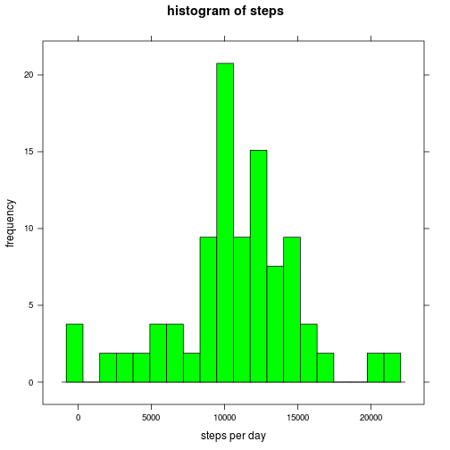
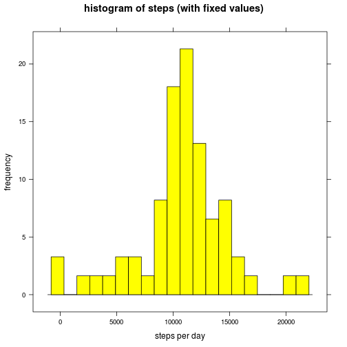

## Loading and preprocessing the data

The libraries which are used in this assigment.

```r
library(RCurl,,quietly = TRUE,warn.conflicts = FALSE)
library(stringr,quietly = TRUE,warn.conflicts = FALSE)
library(sqldf,quietly = TRUE,warn.conflicts = FALSE)
library(lattice,quietly = TRUE,warn.conflicts = FALSE)
```
Download data from web and load to data.table.

```r
# Downloading binary content (zip file) to temoorary file 
binary <- getBinaryURL(
    "https://d396qusza40orc.cloudfront.net/repdata/data/activity.zip",
    ssl.verifypeer=FALSE)
connection <- file({tempFile <- tempfile()}, open = "wb")
writeBin(binary, connection)
close(connection)
# Downloading file ends
activity.data <- read.table(unz(
                               tempFile,
                               "activity.csv"),
                          header=TRUE,
                          sep=",",
                          colClasses = c("numeric","Date","character")
                        )
activity.data$interval <- str_pad(activity.data$interval, 4, pad = "0")
activity.data$interval <- paste(
    substr(activity.data$interval,1,2),
    ":",
    substr(activity.data$interval,3,4))

activity.data$weekday <- weekdays(activity.data$date)
activity.data$isWeekend <- weekdays(activity.data$date) %in% c('Sunday','Saturday')

unlink(tempFile)
rm(tempFile, binary, connection)
head(activity.data)
```

```
##   steps       date interval weekday isWeekend
## 1    NA 2012-10-01  00 : 00  Monday     FALSE
## 2    NA 2012-10-01  00 : 05  Monday     FALSE
## 3    NA 2012-10-01  00 : 10  Monday     FALSE
## 4    NA 2012-10-01  00 : 15  Monday     FALSE
## 5    NA 2012-10-01  00 : 20  Monday     FALSE
## 6    NA 2012-10-01  00 : 25  Monday     FALSE
```

## What is mean total number of steps taken per day?


```r
# Collect needed data. Discard 'NA' values
activity.data.sum <- sqldf("
                           select 
                                date,
                                sum(steps) as steps
                           from 
                                `activity.data` 
                           group by 
                                date
                           having steps != 'NA'")
histogram(
    activity.data.sum$steps,
    main="histogram of steps",
    xlab="steps per day", 
    ylab = "frequency",nint = 20,col="green")
```

 

```r
summary.Of.Days <- summary(activity.data.sum$steps)
print(c(summary.Of.Days["Mean"],summary.Of.Days["Median"]))
```

```
##   Mean Median 
##  10770  10760
```

## What is the average daily activity pattern?

```r
activity.data.avg <- sqldf("
                           select 
                                interval,
                                avg(steps) as stepsAvg
                           from 
                                `activity.data` 
                           group by 
                                interval")

activity.data.max.avg.interval <- sqldf("
                                    select interval as `average max interval of steps`
                                    from `activity.data.avg`
                                    order by stepsAvg desc
                                    limit 1"
                                    )
plot(
    factor(activity.data.avg$interval),
    activity.data.avg$stepsAvg,
    type="l",
    main="Average of interval",
    xlab="intervals",
    ylab="average"
    )

points(factor(activity.data.avg$interval),
       activity.data.avg$stepsAvg,
       type="l")
```

 

```r
activity.data.max.avg.interval[1]
```

```
##   average max interval of steps
## 1                       08 : 35
```

## Imputing missing values

number of NA values as steps in data.

```r
sum(is.na(activity.data$steps))
```

```
## [1] 2304
```
Repairing missing values with means for intervals calculated in section  'What is the average daily activity pattern?'.

```r
activity.data.nas <- subset(activity.data,is.na(steps))

activity.data.nonas <- subset(activity.data,!is.na(steps))

activity.data.fixed.nas <- sqldf("
                select 
                    round(B.stepsAvg) as steps,
                    A.date,
                    A.interval,
                    A.weekday,
                    A.isWeekend
                from 
                    `activity.data.nas` as A
                    left join `activity.data.avg` as B on A.interval=B.interval")
```
Fixed data with calculated averages.

```r
activity.data.fixed <- rbind(activity.data.fixed.nas,activity.data.nonas)
head(activity.data.fixed)
```

```
##   steps       date interval weekday isWeekend
## 1     2 2012-10-01  00 : 00  Monday     FALSE
## 2     0 2012-10-01  00 : 05  Monday     FALSE
## 3     0 2012-10-01  00 : 10  Monday     FALSE
## 4     0 2012-10-01  00 : 15  Monday     FALSE
## 5     0 2012-10-01  00 : 20  Monday     FALSE
## 6     2 2012-10-01  00 : 25  Monday     FALSE
```
Histogram, mean and median of fixed data

```r
activity.data.sum.fixed <- sqldf("
                           select 
                                date,
                                sum(steps) as steps
                           from 
                                `activity.data.fixed` 
                           group by 
                                date")
histogram(
    activity.data.sum.fixed$steps,
    main="histogram of steps (with fixed values)",
    xlab="steps per day", 
    ylab = "frequency",
    nint = 20,
    col="yellow")
```

 

```r
summary.Of.Days <- summary(activity.data.sum.fixed$steps)
print(c(summary.Of.Days["Mean"],summary.Of.Days["Median"]))
```

```
##   Mean Median 
##  10770  10760
```

We can see, that fixing data did not biased mean or median.
Histogram is more concentrated to the mean.

## Are there differences in activity patterns between weekdays and weekends?


```r
activity.data.avg.weekend <- sqldf("
                                   select 
                                        interval,
                                        avg(steps) as stepsAvg
                                   from 
                                        `activity.data` 
                                   where
                                        isWeekend==1
                                   group by 
                                        interval")
activity.data.avg.weekday <- sqldf("
                                   select 
                                        interval,
                                        avg(steps) as stepsAvg
                                   from 
                                        `activity.data` 
                                   where
                                        isWeekend==0
                                   group by 
                                        interval")

par(mfrow=c(2,1),mar = rep(2, 4))

plot(
    factor(activity.data.avg.weekend$interval),
    activity.data.avg.weekend$stepsAvg,
    type="l",
    main="Average of interval weekend",
    xlab="intervals",
    ylab="average"
)

points(factor(activity.data.avg.weekend$interval),
       activity.data.avg.weekend$stepsAvg,
       type="l")

plot(
    factor(activity.data.avg.weekday$interval),
    activity.data.avg.weekday$stepsAvg,
    type="l",
    main="Average of interval weekday",
    xlab="intervals",
    ylab="average"
)

points(factor(activity.data.avg.weekday$interval),
       activity.data.avg.weekday$stepsAvg,
       type="l")
```

 
